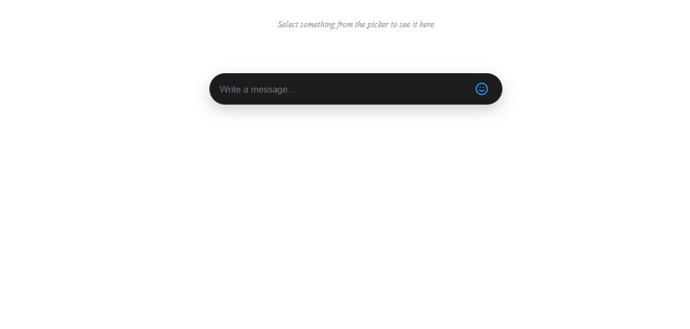
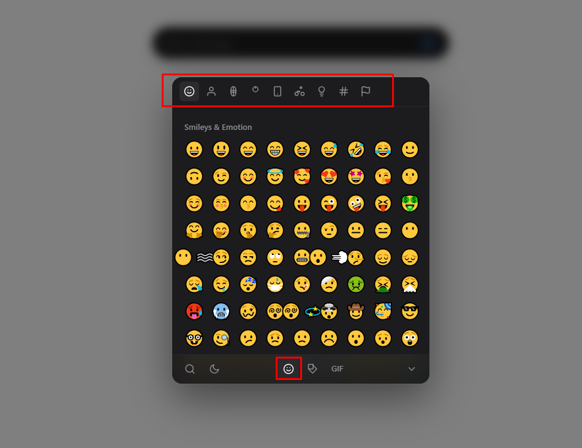
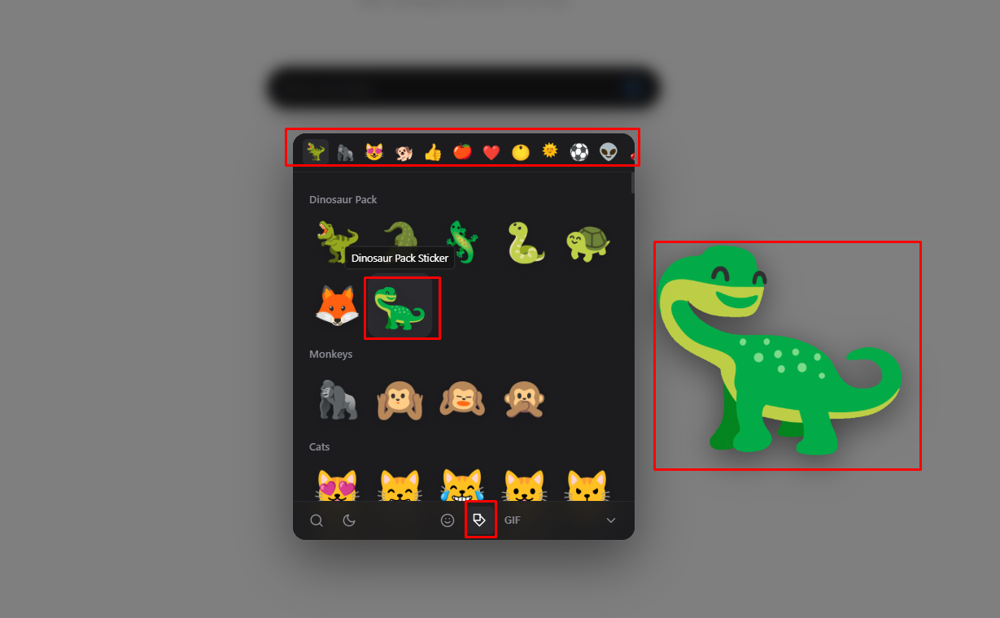
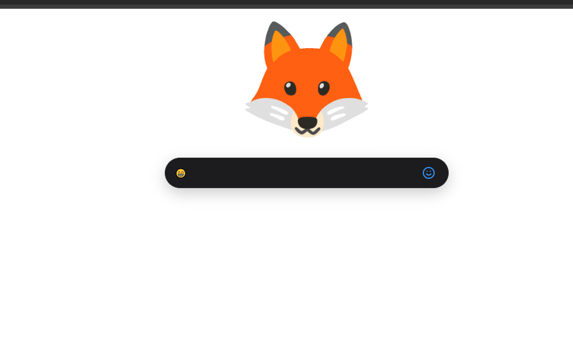
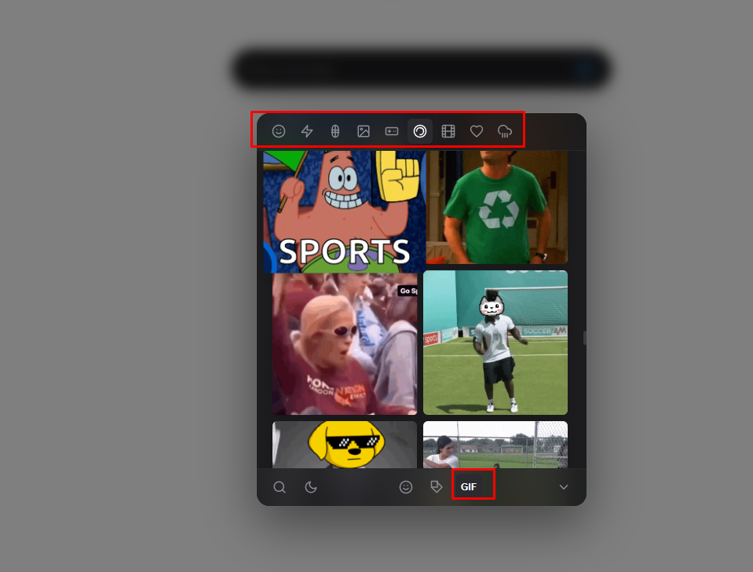
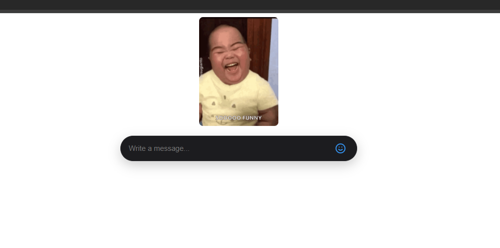

# ESG Studio Picker Library

An ultra-modern, high-fidelity, and lightweight **Emoji, Sticker, and GIF (ESG) Picker** library. Styled in pure, scoped CSS, ESG Studio is highly optimized, fully self-contained, and features rich micro-animations, a built-in independent theme switcher, and an intelligent synonym-based search engine.

---

## Features

- **Simple Programmatic Initialization:** Instantiate on any event (click, keypress, focus, etc.) with a single, clean API call.
- **Automated Singleton Pattern:** Repeated constructor calls automatically update target selectors and callbacks on the existing DOM instance, preventing memory leaks, duplicate elements, and initialization lag.
- **Self-Contained Independent Theme Switcher:** Features a built-in Dark/Light toggle button inside the footer. Scoped CSS variables ensure that changing the picker's theme does _not_ alter the host page's appearance.
- **Telegram-Grade Aesthetics:** Engineered with a compact `420px × 500px` form factor, high-performance glassy backdrops (`backdrop-filter`), hover scaling micro-animations, and clean, scoped typography.
- **Intelligent Synonym Search:** A smart local dictionary expands emotional search terms (e.g. typing `"funny"`, `"sad"`, `"love"`, `"sick"`) to display a beautifully curated set of matching emojis in real-time.
- **Animated Noto Sticker Packs:** Loaded with fully-patched, high-quality animated sticker packs (Google Noto Emoji) representing animals, food, gestures, weather, and sports.
- **Safe Scoped Styling (BEM Methodology):** All style classes begin with `.esg-studio` following standard BEM naming. A scoped layout reset guarantees that your host page remains perfectly unaffected.

---

## Quick Start

### 1. Link Stylesheet & Script

Include the ESG Studio assets inside your HTML file:

```html
<link rel="stylesheet" href="esg-studio.css" />
<script src="esg-studio.js"></script>
```

### 2. Add Your Chat Box & Trigger Button

```html
<div class="composer">
  <input type="text" id="messageInput" placeholder="Write a message..." />
  <button id="togglePickerBtn">😊</button>
</div>
<div id="selectionShowcase"></div>
```

### 3. Initialize inside the Event Listener

Initialize ESG Studio dynamically on any event. The library handles DOM injection, singleton cache lifecycle, event ticks, and bubble propagation guards automatically.

```javascript
document
  .getElementById("togglePickerBtn")
  .addEventListener("click", function () {
    const picker = new ESGStudio({
      onSelect: (type, data) => {
        console.log("Selected:", type, data);
        if (type === "emoji") {
          // Append emoji to text input
          const messageInput = document.getElementById("messageInput");
          messageInput.value += data;
          messageInput.focus();
        } else if (type === "sticker" || type === "gif") {
          // Showcase selected sticker/GIF and close picker
          const selectionShowcase =
            document.getElementById("selectionShowcase");
          selectionShowcase.innerHTML = ``;
          picker.hide();
        } else {
          console.error("Invalid type");
          picker.hide();
        }
      },
    });
  });
```

---

## Preview Gallery

|                                    |                                    |                                    |
| :--------------------------------: | :--------------------------------: | :--------------------------------: |
|  |  |  |
|  |  |  |

---

## Configuration Options

| Option           | Type                  | Default    | Description                                                                                                                                 |
| :--------------- | :-------------------- | :--------- | :------------------------------------------------------------------------------------------------------------------------------------------ |
| `trigger`        | `String` \| `Element` | `null`     | Optional. Selector or Element to bind the click event. If omitted, the picker assumes an on-demand programmatic call and shows immediately. |
| `theme`          | `"dark"` \| `"light"` | `"dark"`   | Sets the initial visual theme of the picker.                                                                                                |
| `onSelect`       | `Function`            | `() => {}` | Callback executed when an item is selected. Arguments: `(type, data)` where `type` is `"emoji"` \| `"sticker"` \| `"gif"` \| `"backspace"`. |
| `enableEmojis`   | `Boolean`             | `true`     | Show or hide the Emojis tab inside the footer.                                                                                              |
| `enableStickers` | `Boolean`             | `true`     | Show or hide the Stickers tab inside the footer.                                                                                            |
| `enableGifs`     | `Boolean`             | `true`     | Show or hide the GIFs tab inside the footer.                                                                                                |

---

## API Methods

You can call the following methods on any `ESGStudio` instance:

### `.show()`

Forces the picker to display.

```javascript
picker.show();
```

### `.hide()`

Hides the picker from the screen.

```javascript
picker.hide();
```

### `.toggle()`

Toggles the visibility of the picker.

```javascript
picker.toggle();
```

### `.setTheme(theme)`

Programmatically switches the theme inside the picker.

- **Arguments:** `"light"` \| `"dark"`

```javascript
picker.setTheme("light");
```

### `.setEmojisEnabled(enabled)`

Dynamically shows/hides the Emojis tab at runtime.

- **Arguments:** `true` \| `false`
- **Alias:** `.enableEmojis(enabled)`

```javascript
picker.setEmojisEnabled(false); // Instantly hides Emojis tab
```

### `.setStickersEnabled(enabled)`

Dynamically shows/hides the Stickers tab at runtime.

- **Arguments:** `true` \| `false`
- **Alias:** `.enableStickers(enabled)`

```javascript
picker.setStickersEnabled(false); // Instantly hides Stickers tab
```

### `.setGifsEnabled(enabled)`

Dynamically shows/hides the GIFs tab at runtime.

- **Arguments:** `true` \| `false`
- **Alias:** `.enableGifs(enabled)`

```javascript
picker.setGifsEnabled(false); // Instantly hides GIFs tab
```

---

## File Structure

- `esg-studio.js` — All engine logic, UI template compiler, dynamic DOM event binding, search dictionary, and assets.
- `esg-studio.css` — Scoped layout reset, custom CSS property themes, BEM grid alignments, and premium glassy transition animations.
- `index.html` — Minimal sandbox showing the integration of the picker inside an on-demand event listener.

---

## Contributing & Open Source

This library is **completely open source**! We passionately welcome contributions from the developer community to help make ESG Studio the absolute best emoji, sticker, and GIF picker library in the ecosystem.

Whether you want to:

- Add exciting new sticker packs or custom categories.
- Optimize the synonym search dictionary or add new languages.
- Improve the rendering performance, animations, or styling.
- Report bugs, request features, or propose API extensions.

Anyone is welcome to contribute! Simply fork the repository, make your awesome changes, and submit a pull request. We would love to collaborate with you!

---

## License

Created under the ESG Studio brand. Open-source, lightweight, and engineered for high-performance messaging interfaces.
# ESG-Studio-JavaScript-Picker-Library
